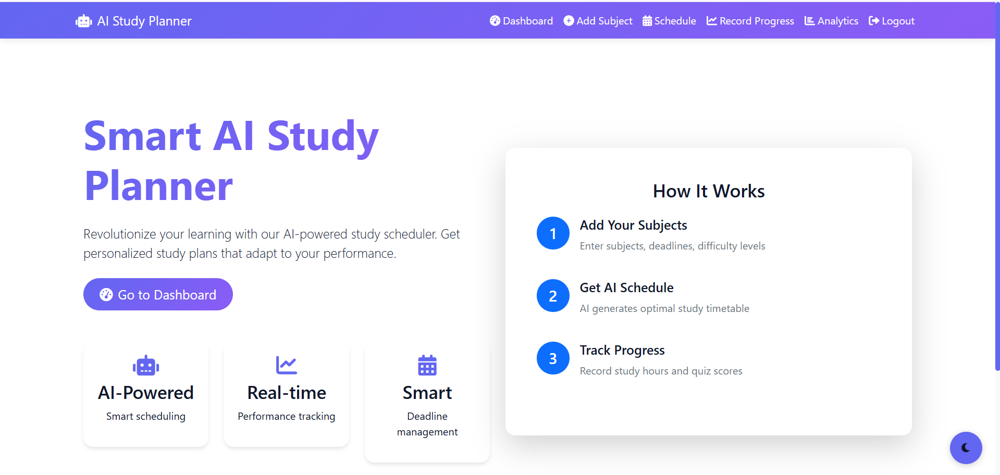
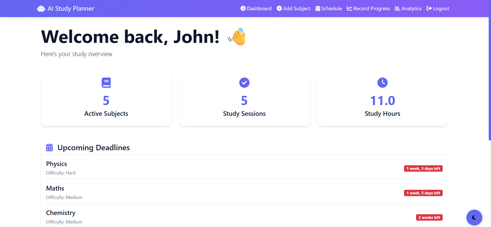
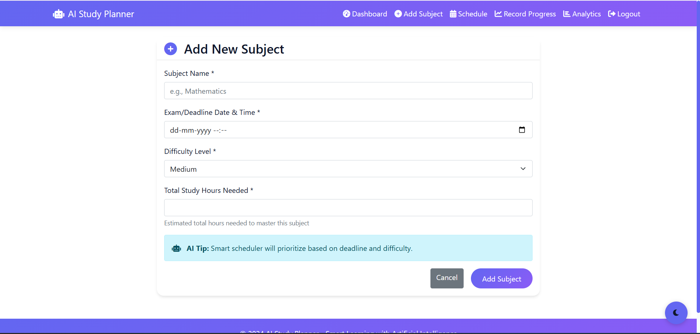
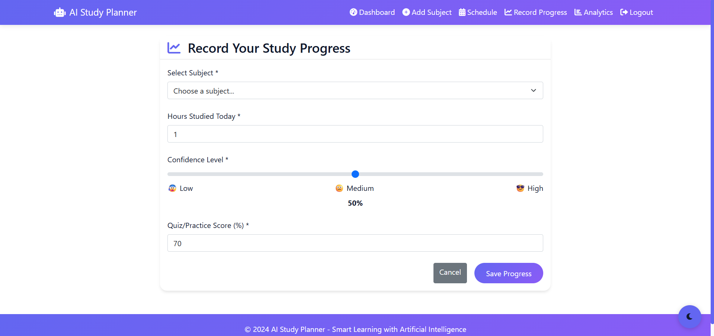
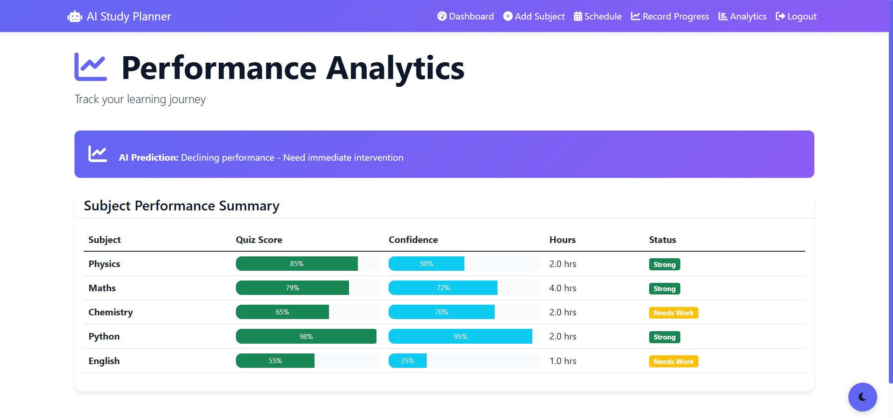
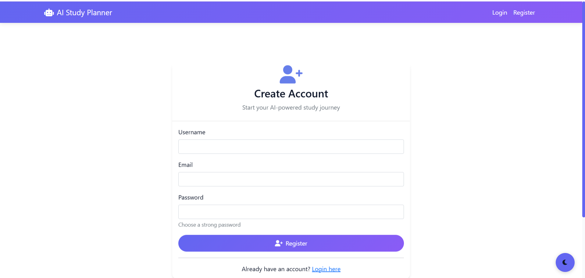

# 📚 AI Study Planner

An AI-powered Django web application that helps students plan, manage, and optimize their study schedules effectively.

---

## 🚀 Features

* 📅 Smart Study Scheduling
* 📊 Progress Tracking & Analytics
* 🤖 AI-Based Study Recommendations
* 🔐 User Authentication (Login/Register)
* 📈 Dashboard with insights

---

## 🛠️ Tech Stack

* Backend: Django
* Frontend: HTML, CSS, JavaScript
* Database: SQLite
* AI Logic: Custom Python algorithms
* UI: Bootstrap 5

---

## 📂 Project Structure

```
ai-study-planner/
│
├── planner/                # Core app
├── advanced_features/      # AI and extra features
├── study_planner/          # Project settings
├── templates/              # HTML files
├── static/                 # CSS & JS
├── manage.py
```

---

## ⚙️ Setup Instructions

1. Clone the repository
2. Install dependencies
3. Run the server

```
pip install -r requirements.txt
python manage.py runserver
```

---

## 🎯 Future Improvements

* Add real AI/ML model
* Deploy on cloud (AWS/Render)
* Add mobile responsiveness
* Improve UI/UX

---

## 📸 Screenshots

### 🏠 Home Page


### 📊 Dashboard


### ➕ Add Subject


### 📈 Progress Tracking


### 📊 Analytics


### 🔐 Authentication


---

## 👩‍💻 Author

Janani.V
